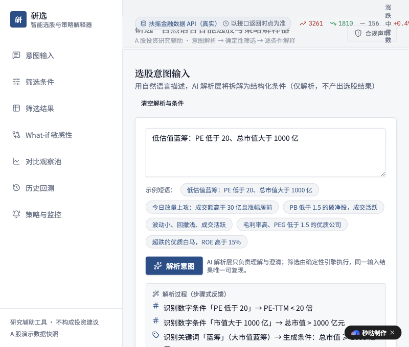
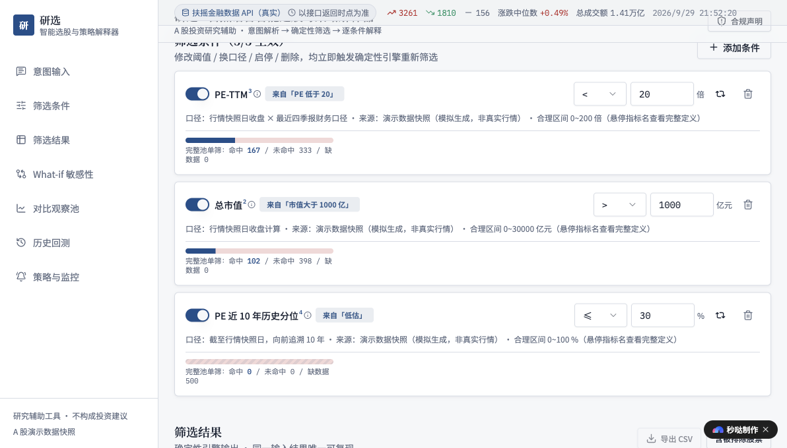

# 研选 · 自然语言智能选股与策略解释器

> 黑客松课题《自然语言智能选股与策略解释器》原型实现 · 面向 A 股投资研究场景的**研究辅助工具**（不构成任何投资建议）

一句话：**把"我想找一类股票"说成一句话，系统把它翻译成可检查、可修改、可复现的筛选条件，由确定性引擎算出候选名单，并逐条解释"为什么入选 / 为什么被排除 / 条件改一改结果会怎么变"。**

- **线上演示**：https://app-eq639ktulblt.miaoda.online （默认演示数据快照；填入扶摇 API Key 即切真实行情）
- **源码仓库**：本仓库（stock-screener）

---

## 一、这是干嘛的：它能在哪些真实的地方产生价值

不是玩具。做这个工具时，我问的是"券商/私募研究员、散户投研人群，日常到底在重复干什么"，然后只实现那些**换人也要做、且主观判断容易出错**的环节：

| 真实工作流环节 | 传统做法 | 本工具做了什么 |
| --- | --- | --- |
| 把领导/自己的一句话需求变成可执行条件 | 口头转述，口径不清：「低估值」可能是 PE < 20，也可能是 PE 分位 < 30% | 拆成条件卡片，每个条件带**口径四要素**（定义/统计时点/数据来源/单位）；歧义词弹窗让用户选口径，不替用户拍板 |
| 确认条件之间是否矛盾 | 靠经验判断 | 硬冲突自动阻断（如同时要"高股息"和"高成长"），张力组合给出警示 |
| 筛完不知道为什么这只进那只没进 | 全凭人工翻 | 每只候选股都有**逐条件核对单**：实际值 vs 阈值，标注"通过/不通过/数据缺失"三态，含被排除股票 |
| 换一个阈值重跑 | 改表头、重新筛选、人脑对比 | What-if 敏感性：任一条件 ±10% / ±20%，展示"放宽新纳入 / 收紧被剔除"的边际名单 |
| 把候选名单给同事/留档 | 截图、复制 | 一键导出 CSV（UTF-8 BOM，Excel 打开中文不乱码），结果可带走二次加工 |
| 检验策略是否真的有效 | 凭感觉 | 简化历史回测（季度调仓、等权持有 vs 沪深300 演示基准），并**如实标注回测局限**（财务按披露时点取值/未计交易成本/幸存者偏差） |
| 同一套条件反复用 | 每次重敲 | 条件集可保存为命名策略，一键重跑 |

**核心立场：AI 只负责"听懂人话并澄清歧义"，筛选本身是确定性规则引擎。** 同一句话、同一份数据，任何人任何时候跑，结果完全一致——这是"工具"和"AI 聊天机器人"的本质区别：**可检查、可复现、可追溯**。研究类工作最怕的就是"黑箱结论"。

---

## 二、怎么设计的（关键决策与理由）

1. **解析与执行分离（最重要的设计）**
   自然语言理解是概率性的，筛选结果必须是确定性的。因此系统分两层：`parser`（规则式 NLU：数字条件抽取 + 关键词模板 + 歧义确认 + 冲突检测 + 语义去重）和 `screener`（纯函数求值）。AI 不直接"给答案"，只产出结构化条件。这一边界在页面上明示，防止"AI 幻觉筛选结果"。

2. **条件语义去重合并（真实 bug 驱动）**
   实测发现「超跌的优质白马，ROE 高于 15%」会同时命中数字抽取（ROE>15）与关键词模板（白马→ROE≥15），生成两条近似重复条件，导致排除原因 Top 出现并列重复项。修复：按「同指标 + 同向比较 + 阈值一致（容差 1e-6）」自动合并，并在解析过程步骤中**明示合并理由**；不同阈值保持并存，不做蕴含化简（避免 AI 替用户做主）。配套单测覆盖合并/并存两场景。

3. **三态判定，数据缺失绝不掩盖**
   每条条件对每只股票只给三个结论：通过 / 不通过 / 数据缺失。真实接口没有某字段（如 PE 历史分位）时，整列如实标"缺数据"并写明原因——**绝不静默赋默认值后假装正常结论**。这正是"研究工具可信度"的底线。

4. **事实与推断分开标注**
   字段数值是「客观事实」（可追溯到字段/时点/单位/来源），筛选归属、What-if、回测结论是「模型推断」。界面用标签区分。

5. **数据源抽象（Provider 接口）**
   定义统一 `DataProvider` 接口（loadStocks / enrich / getMarketContext），内置 `DemoSnapshotProvider`（无 Key 默认，页面顶部显式标注）与 `FuyaoApiProvider`（真实行情）。接口失败红色 Alert + 重试，**不静默降级**为演示数据伪装实时结论。

6. **市场环境先行（贴合真实投研习惯）**
   真实研究员动手筛股前先看大盘：涨跌家数、中位数、总成交额。真实模式下这些由已拉取的全市场快照聚合而来，**零额外请求**。

---

## 三、底层实现与架构

```
┌────────────┐   一句话意图   ┌──────────┐  条件卡片(口径完备)  ┌──────────┐
│   UI 面板  │ ────────────▶ │ parser   │ ─────────────────▶ │ screener │
│ 7 个分区   │ ◀──────────── │ 规则式NLU│  ◀───────────────── │ 确定性引擎│
│            │  解析过程/解释  │ 去重/冲突│  解释/核对单/What-if│ 三态判定  │
└─────┬──────┘               └──────────┘                     └────┬─────┘
      │                         ▲                                 ▲
      │                  仅翻译/澄清                          纯函数，无 AI
      └──────────────────┬──────┴─────────────────────────────────┘
                         ▼
              ┌────────────────────┐
              │ DataProvider 抽象  │
              ├─────────┬──────────┤
              │ demo    │ fuyao    │──→ 扶摇金融数据 API（真实）
              │ (内置)  │ (真实)   │    direct 直连 / proxy 代理双模式
              └─────────┴──────────┘    分块并发 + 缓存 + 限流
```

- **技术栈**：React 18 + TypeScript + Vite + Tailwind CSS + shadcn/ui + recharts · Vitest 单测（44 项全绿）
- **数据层** `src/data/`
  - `metrics.ts` — 指标目录，全站唯一口径来源（每个指标强制携带口径四要素）
  - `provider.ts` — Provider 抽象与自动探测（localStorage 有 Key → fuyao）
  - `fuyaoApi.ts` — 扶摇 API 客户端（direct/proxy 双模式、分块并发、缓存、限流）
  - `fuyaoMapper.ts` — 扶摇字段 → 内部 Stock 结构映射，缺失原因显式标注（纯函数、可单测）
  - `stocks.ts / history.ts` — 演示快照（71 只，确定性生成、含缺失值注入）与回测历史（财务滞后一期防未来函数）
- **引擎层** `src/engine/` — 全部纯函数：`screener`（三态求值）、`parser`（意图解析）、`conflict`（冲突/张力检测）、`whatif`（敏感性）、`backtest`
- **状态层** `src/state/ScreenerContext.tsx` — 全局状态（数据源、条件、候选、解释）
- **UI 层** `src/components/screener/` — 意图输入 / 筛选条件 / 筛选结果 / What-if / 对比观察池 / 历史回测 / 策略与监控

---

## 四、怎么接入真实数据（扶摇金融数据 API）

真实 API 已接通，**无需改任何代码**。Key 只经过环境变量 / 浏览器 localStorage 传递，**绝不写入代码仓或文档**。

### 线上部署（直连模式，5 秒切换）
1. 打开线上应用，点击顶部「数据源」状态条，粘贴扶摇 API Key（或控制台执行 `localStorage.setItem('fuyao_api_key', '您的Key')` 后刷新）
2. Key 仅保存在本机浏览器 localStorage；填 Key 后状态条切换为「扶摇金融数据 API（真实）」
3. 前端直连 `https://fuyao.aicubes.cn/api`（CORS 已放行），请求头带 `X-api-key`
4. 不填 Key → 自动使用内置演示数据快照，并显式标注，绝不伪装

### 本地开发（代理模式，Key 不进 bundle）
```bash
# .env（已被 .gitignore 排除，不进仓库）
FUYAO_API_KEY=您的Key

npm install
npm run dev      # 前端走 /fuyao/api 代理，Key 仅存于本地进程环境变量
```

### 真实数据覆盖口径（诚实披露）
- 全市场：行情快照（涨跌/成交额/最新价）+ 估值快照（PE-TTM/PB/PS/PCF）+ 竞价快照（流通市值）——**均为真实接口字段**
- **不提供**：PE/PB 历史分位、行业中位数、北向持股、ROE/股息率/增速等财务指标（已逐一探测确认接口不存在）→ 这些条件下真实模式**整列标注"数据缺失"并写明原因**，绝不造数
- 大盘广度口径：沪深 A 股（北交所暂不纳入），快照时点以接口返回为准

### 降级与合规
- 接口失败：红色 Alert + 重试按钮，不静默降级为演示数据伪装实时结论
- 不构成投资建议；不输出确定性涨跌预测、收益承诺或买卖建议

---

## 五、怎么使用（真实使用流程）

### 本地运行与测试
```bash
npm install
npm run dev        # 开发服务器（默认演示数据）
npm run build      # 类型检查 + 生产构建
npm run test       # Vitest 单测（44 项：解析/筛选/冲突/What-if/回测/CSV/扶摇映射）
```

### 完整使用流程（线上真实数据链路实测，2026-09-29）

**用例一：低估值蓝筹（真实数据）**

1. 线上打开应用 → 点击数据源状态条填入扶摇 Key → 状态条变为「扶摇金融数据 API（真实）」，市场环境快照刷新为真实聚合：
   **上涨 3261 / 下跌 1810 / 平 156，涨跌中位数 +0.49%，总成交额 1.41 万亿，时点 2026/9/29 21:52:20**
2. 点击示例短语「低估值蓝筹：PE 低于 20、总市值大于 1000 亿」→ 点「解析意图」
3. 解析层产出 3 条条件卡片，并给出步骤式解析过程（识别数字条件 / 关键词映射 / 语义去重明示）：
   - PE-TTM < 20（来自「PE 低于 20」）
   - 总市值 > 1000 亿元（「蓝筹」语义重复被合并明示）
   - PE 近 10 年历史分位 ≤ 30%（来自「低估」关键词）
4. 每条条件卡片展示**单筛三态统计**（真实接口逐只判定）：
   - PE-TTM < 20：命中 167 / 未命中 333 / 缺数据 0
   - 总市值 > 1000 亿：命中 102 / 未命中 398 / 缺数据 0
   - PE 历史分位 ≤ 30%：命中 0 / 未命中 0 / **缺数据 500**（真实接口无此字段，全池如实标注，不静默赋默认值）
5. 组合筛选 → 结果列表可排序/分页/行业排除/导出 CSV；打开任意候选行查看逐条件核对单（三态 + 实际值 vs 阈值 + 时点来源）
6. What-if：把「PE < 20」改为 24（+20%），观察新纳入/剔除的边际名单

**用例二：今日放量上攻（真实数据）**
1. 输入「今日放量上攻：成交额高于 30 亿且涨幅居前」→ 解析为「近20日日均成交额 > 30 亿」+ 动量排序
2. 结果区按涨跌幅降序排列，逐只展示实际涨跌幅与成交额；不满足条件的候选显示被排除原因

---

## 六、真实使用截图

### 截图 1 · 意图解析（真实数据源：市场环境快照为真实聚合）



图中实证：状态条「扶摇金融数据 API（真实）」、市场广度为真实聚合（3261 涨 / 1810 跌 / 中位数 +0.49% / 成交额 1.41 万亿）、解析过程步骤式反馈、3 条条件卡片生成。

### 截图 2 · 条件卡片三态判定（真实接口逐只判定）



图中实证：三条条件的单筛三态统计全部来自真实接口逐只判定；「PE 近 10 年历史分位」因真实接口无此字段，**500 只整列标注"数据缺失"**——这是"诚实标注、不静默造数"的产品级证明。

---

## 七、验证记录

- **本地单测**：44 项全绿（vitest run），覆盖解析/去重合并/冲突/筛选三态/What-if/回测/CSV 编码/扶摇字段映射
- **浏览器实测**（真实 Chrome）：

| 场景 | 结果 |
| --- | --- |
| 「超跌的优质白马，ROE 高于 15%」条件去重 | ✅ 解析步骤明示合并理由，排除原因 Top 无重复项 |
| 表头排序 ↔ 下拉排序双向同步 | ✅ |
| 含被排除视图 + 分页（20/50/100） | ✅ 72 行、翻页正确 |
| 行业排除 / 恢复 | ✅ 排除后 66 行，恢复后 72 行 |
| What-if 敏感性 | ✅ 放宽纳入 4 只 / 收紧剔除 2 只 |
| CSV 导出 | ✅ 浏览器触发下载，落盘系统下载目录 |
| 真实数据源接入（扶摇 Key） | ✅ 状态条切真实源；全市场快照 5578 条真实映射；三态判定逐只真实 |
| 接口失败 / 无 Key | ✅ 红色 Alert + 重试；无 Key 回退演示数据并显式标注 |

---

## 八、反思与边界（诚实写出做了什么、没做什么）

**做对了什么**
- 解析/执行分离让"AI 辅助"与"结果可信"不冲突：本事用 AI 的地方（意图理解、歧义澄清）用了，不能交给概率模型的地方（筛选求值）一点都没交
- 数据缺失三态、事实/推断分标、回测局限明示——这些"克制"的设计才是研究工具真正的护城河
- 真实 API 链路完整打通并截图实证，不是"预留接口但没跑通"的演示

**已知边界（未做/受限，如实声明）**
- 真实数据源当前只覆盖行情/估值/市值字段；PE/PB 历史分位、行业中位数、北向持股、ROE/股息率/增速等财务指标在扶摇接口中不存在，真实模式下这些条件整列缺数据。演示数据源中这些指标是模拟生成，仅用于演示解析与筛选交互，**不代表真实值**
- 自然语言解析是规则式（关键词 + 数字模式），覆盖面限定在已定义模板；未训练的表述会提示"以下内容未转化为条件"，并允许手动添加条件——**不假装全能理解**
- 历史回测为简化版：季度末调仓、等权持有、未计交易成本、存在幸存者偏差，仅作相对比较参考，不等于策略未来表现
- 演示数据快照为确定性生成，非实时行情；无 Key 时页面顶部显式标注，避免误读
- 未做：行情分钟级可视化、基本面深度财务筛选（依赖接口补全）、策略自动交易、消息面/舆情因子
- 合规红线：不构成投资建议，不输出确定涨跌预测/收益承诺/买卖建议；所有关键数字可追溯到字段、时点、单位与口径

**AI 使用与验证记录**：AI 承担了架构设计、核心逻辑实现与单测编写；所有关键结论均经浏览器实测与单测验证（见"验证记录"），并在 README 中如实标注已做/未做，不夸大。